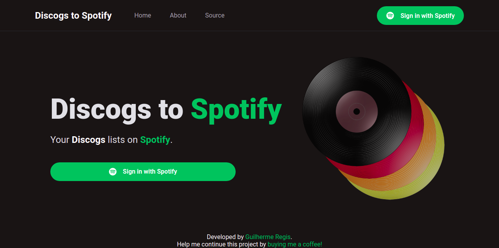
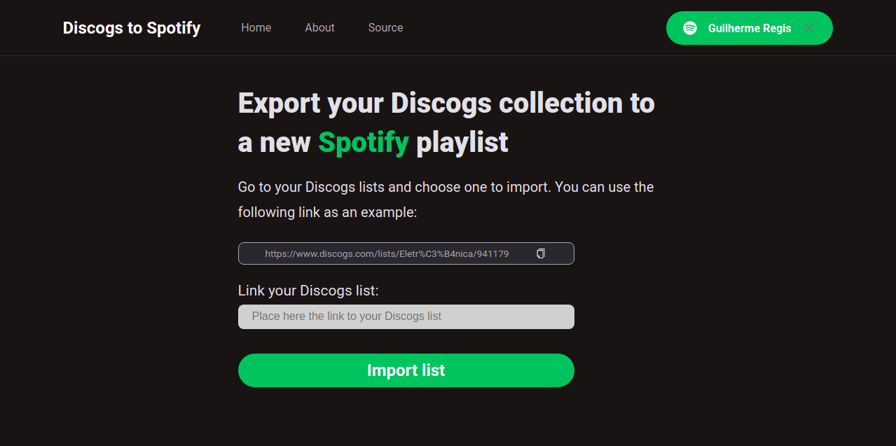
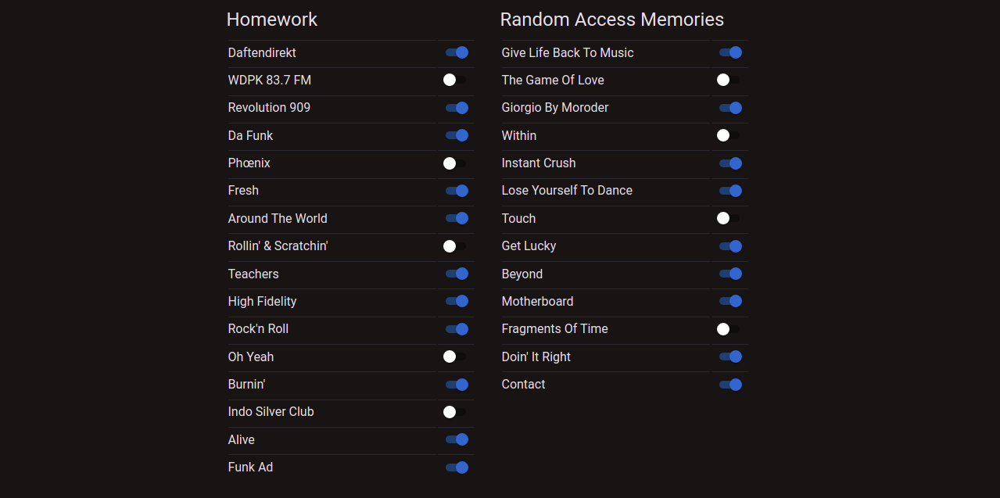
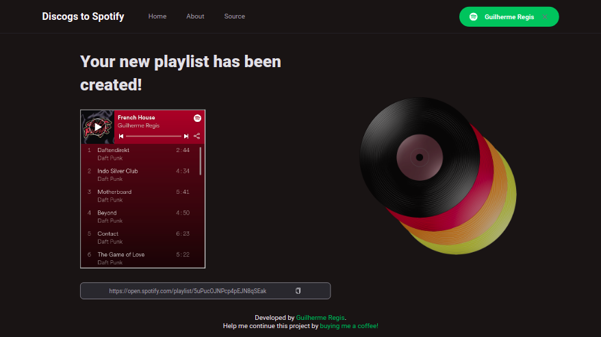

# Discogs to Spotify



<p align="center">About</p>

Discogs to Spotify is a app that creates Spotify playlists based on any Discogs list.
It is simple and intuitive and you can test it even if you're not a Discogs user (hope you enjoy Daft Punk!).

Just sign in with your Spotify account and link any Discogs list. Then you will select the tracks you want to import, give a name to your new Spotify playlist (that will be available on your Spotify profile) and listen to the songs, using our app or the Spotify client!

Built using React with NextJS, SASS and JavaScript.
OAuth2 using next-auth and HTTP requests using AXIOS.

The main purpose is to integrate Discogs API with Spotify API. In future versions I plan to add more features, such as importing collections and wishlists from Discogs, as well as creating collections on Spotify.

# Technologies

* React
* Next
* next-auth
* AXIOS
* SASS
* Material UI
* JavaScript

# Linter

* ESLint

<p>More screenshots</p>






## Getting Started

First, run the development server:

```bash
npm run dev
# or
yarn dev
```

Open [http://localhost:3000](http://localhost:3000) with your browser to see the result.

You can start editing the page by modifying `pages/index.js`. The page auto-updates as you edit the file.

[API routes](https://nextjs.org/docs/api-routes/introduction) can be accessed on [http://localhost:3000/api/hello](http://localhost:3000/api/hello). This endpoint can be edited in `pages/api/hello.js`.

The `pages/api` directory is mapped to `/api/*`. Files in this directory are treated as [API routes](https://nextjs.org/docs/api-routes/introduction) instead of React pages.

